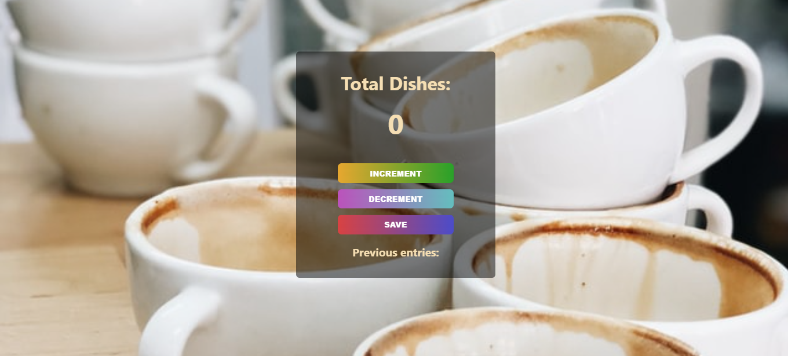

# Passenger Counter

## Table of Content

 * [Overview of the Project](#overview-of-the-project)
      * [Goal of the project](#goal-of-the-project)
      * [Screenshot](#screenshot)
 * [Technologies I Used](#technologies-i-used)
 * [What I Learned](#what-i-learned) 
 * [What I did](#what-i-did)
 * [Acknowledgment](#acknowledgment)

# Overview of the Project
The goal of the project is to count dishes. In a scenario where there is large function which requires n number of dishes to be used, and n number of dishes are used every hour. So this app will help to manage how many dishes have been taken in that particular hour and you can save the data too.The main focus is on Javascript concepts.

### Goal of the Project
* The Goal of this project is to count dishes in a large function where managing is difficult.
* To style the project with HTML and CSS.
* To add a increment button to count dishes.
* To add a save button to save the total number of dishes counted in a hour.

## Screenshot

## Technologies I Used
* Semantic HTML5
* CSS
* Javascript

## What I Did
* I added a decrement button to decrease the count for better functionality.
* Added transition and transform property to style buttons.

## What I Learned
* Styling the website with HTML and CSS
* Learned how to call an element in Javascript.
* learned about Functions and how to call a function.
* How to use increment and display the content using textcontent.

## Acknowledgment
   My acknowledgements go out to the team at Scrimba. Enrolling in your courses made this project possible.
